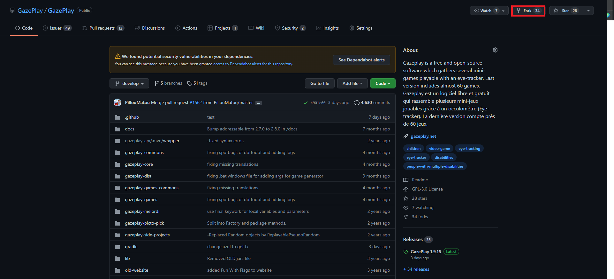
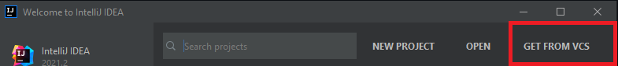

# How to install GazePlay

## Prerequisites

You must have:
* a github account.
* a jetbrains account for Intellij. (you can create them as you install)

 Note :
* the github account is free.
* the jetbrains account is free for students. (you have to fill in your student email address)

## Step 1 : Install Intellij ultimate edition

The download of Intellij **VERSION ULTIMATE** is here : https://www.jetbrains.com/idea/download/#section=windows
 
If you don't download the ultimate version it won't work because spring is not supported by the classic version.

Then run the installer and follow the installation procedure

## Step 2 : Fork the project Gazeplay

To fork the project, go to the Gazeplay git repository: https://github.com/GazePlay/GazePlay
 
Then click on the fork button at the top right of the screen.

## Step 3 : get the forked project

Start Intellij, it will ask you to connect with your account (you have to create it if you don't have one).
  Once connected go to "get from vcs" select your account.

Then select the gazeplay project and clone.

## Step 4 : télécharger le SDK azul-17

In Intellij, you have to download the azul-17 SDK.
 
To do this: file -> project structure -> SDKs -> "+" -> download JDK

Make sure that the project is properly configured on the previously downloaded azul-11.
 
To do this: file -> project structure -> Project

## Step 5 : Check JDK on Gradle settings

Check if gradle use the Azul JDK 17, else change it.

## Step 6 : Build the project

To launch the build: press the green hammer at the top right of the screen and the build will start.

Normally you get this.

If the edit configuration is not created after the build, restart the intellij.

## Step 7 : start the projet

To launch the project: press the green arrow at the top right of the screen and gazeplay will start.

Try to run at least one game.

## You have completed the installation

From here you have finished the installation.

If you encounter any problems, do not hesitate to contact the team.
