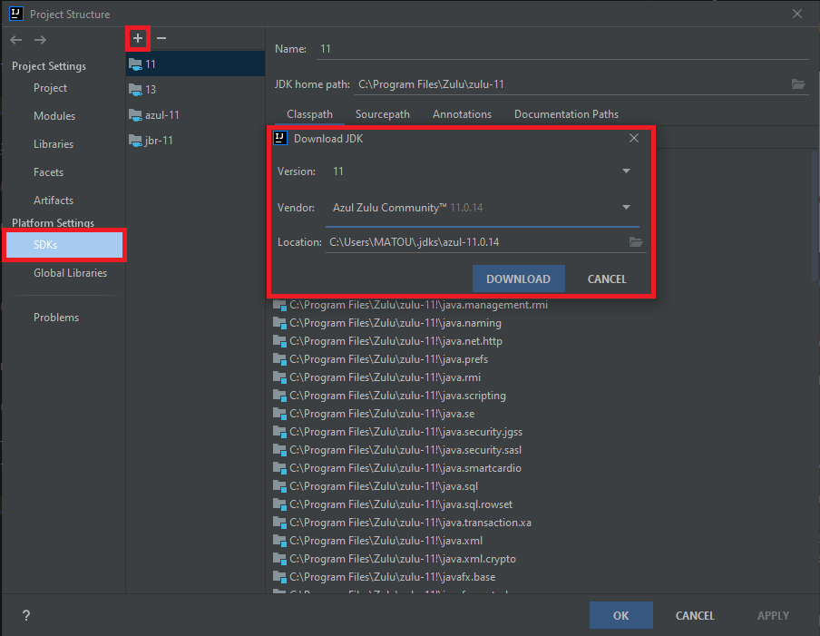
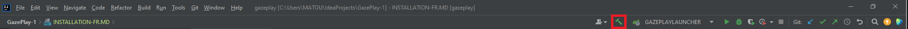
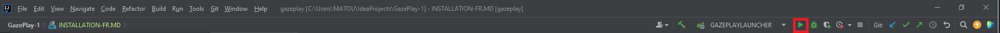

# Comment installer GazePlay

## Prérequis

Il faut avoir un compte github et un compte jetbrains pour Intellij. (vous pouvez les créer au fur et à mesure de l'installation)
 Précision : le compte github est gratuit, le compte jetbrains est gratuit pour les étudiants. (il faut renseigner votre adresse mail étudiante)

## Etape 1 : Installer Intellij ultimate edition 

Le téléchargement d'Intellij **VERSION ULTIMATE** est ici : https://www.jetbrains.com/fr-fr/idea/download/#section=windows
 
Si vous ne téléchargez pas l'ultimate ça ne marchera pas car spring n'est pas pris en charge par la version classique.

Puis exécuter l'installateur et suivez la procédure d'installation.

## Etape 2 : Forker le projet Gazeplay

Pour forker le projet, il faut aller sur le dépôt git Gazeplay : https://github.com/GazePlay/GazePlay
 
Puis cliquer sur le bouton fork en haut à droite de l'écran.

## Etape 3 : récupérer le projet forké

Lancer Intellij, celui-ci vous demandera de vous connecter avec votre compte (il faut le créer si vous n'en avez pas).
  Une fois connecté aller dans "get from vcs" sélectionner votre compte, puis sélectionner le projet gazeplay et cloner.

## Etape 4 : télécharger le SDK azul-11

Dans Intellij, il faut télécharger le SDK azul-11
 
Pour ce faire : file -> project structure -> SDKs -> "+" -> download SDK

Assurez-vous que le projet est bien configuré sur l'azul-11 téléchargé précédemment.
  
Pour ce faire : file -> project structure -> Project

## Etape 5 : Build le projet

Pour lancer le build : appuyer sur le marteau vert en haut à droite de l'écran et le build va se lancer.

Si l'edit configuration n'est pas créé suite au build, redémarrer l'intellij.
  Normalement on obtient ceci

## Etape 6 : lancer le projet

Pour lancer le projet : appuyer sur la flèche verte en haut à droite de l'écran et gazeplay va se lancer.

## Vous avez terminer l'installation

A partir d'ici vous avez fini l'installation.

Si vous rencontrez des problèmes n'hésitez pas à contacter l'équipe.
