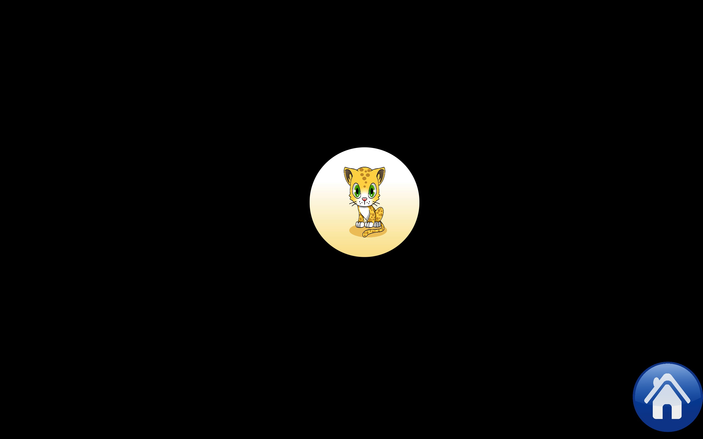
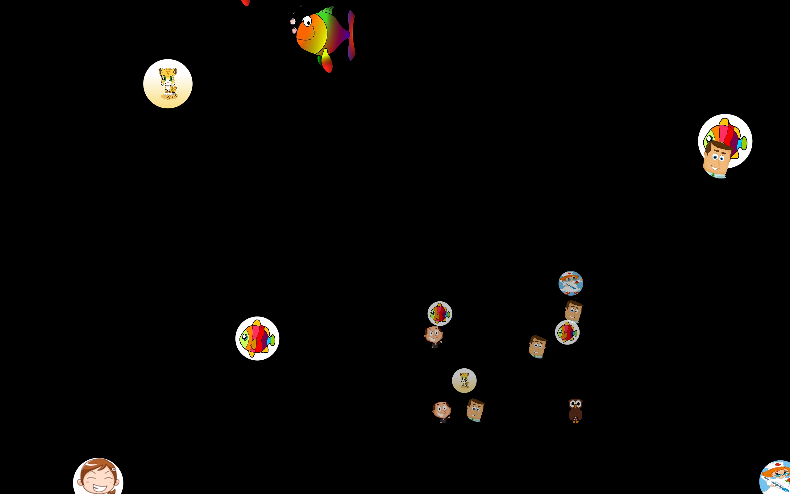

# GazePlay

* Read this in other languages: [English](README/README.en.md) [French](README.md)

Gazeplay est un logiciel **gratuit** qui rassemble plusieurs mini-jeux jouables grâce à un occulomètre (*Eye-tracker*). La dernière version compte 12 jeux.

Le logiciel est fourni avec des images par défaut mais il est facile de mettre les siennes avec lesquelles le joueur interagira plus facilement.

## Vidéo de présentation

## Système requis

GazePlay fonctionne sous Windows, MacOs et Linux.

Il est utilisable par tout occulomètre (Eye-tracker) capable de diriger la souris mais également avec

- Tobii : modèles *Tobii EyeX* et *Tobii 4C* (compatibles Windows)
- Eye Tribe : modèle *Eye Tribe Tracker* (compatibles Windows et MacOs X)

## Principe

De nombreux polyhandicapés ne sont pas capables d'utiliser de manière assez précise ni leurs membres (mains, pieds), ni leur voix. Les outils ou jeux sur terminaux numériques leur sont ainsi inaccessibles. Le regard semble alors être, dans bien des cas, la manière la plus directe de leur permettre d'interagir.

Il s’agit d’utiliser ce qu’on appelle des eye-trackers, appareils qui permettent de savoir ou se pose le regard d’un individu. Évidement ces jeux doivent rester simples et les interactions assez directes pour permettre aux individus de comprendre et assimiler les conséquences de leurs actions, c'est-à-dire les conséquences de leur regard. On peut imaginer des jeux consistant à tirer sur des cibles, des casses-briques, des jeux de cartes, des mémory,...

Ces jeux offrent au moins deux avantages à l'individu :

1) le divertir ;

2) lui permettre d'entraîner son regard afin de lui offrir la possibilité d'acquérir des interactions plus complexes. Il s’agit ainsi d’une première étape visant la possibilité de mettre en place une véritable communication basée sur des pictogrammes par exemple.

## Jeux

Ils sont actuellement 12 jeux (dont 6 variantes).

<!--  -->

### Tartes à la crème

Le joueur lance une tarte à la crème sur la cible statique lorsqu'il la regarde.

### Ninja

La cible suit des mouvements aléatoires et explose lorsque le joueur la regarde.

### Cartes magiques

Plusieurs cartes sont affichées et le joueur doit les regarder pour les retourner. L'une de ces cartes comporte une image.
Une récompense est offerte au joueur lorsqu'il l'a trouvée.

### Blocs

Une grande image est cachée par des blocs de couleur que le joueur doit regarder pour les faire disparaître. Lorsque l'ensemble des blocs ont disparu, la récompense est offerte.

### Cartes à gratter

Une grande image est cachée dans une carte à gratter. Le joueur gratte la carte grâce à son regard. Lorsque une grande partie de la carte a été grattée, l'image est affichée et la récompense offerte.

### Bulles

Des bulles de couleur remontent lentement à la surface et exploser lorsque le joueur les regarde.

### Bulles Portrait

Des bulles contenant des portraits remontent lentement à la surface et exploser lorsque le joueur les regarde.

## Téléchargements

[Dernière Version](https://github.com/schwabdidier/GazePlay/releases/download/GazePlay-1.1-release-candidate-1/GazePlay-V1.01-candidate-1.jar)

## Installation

Copiez-collez ou déplacez le fichier téléchargé sur votre disque dur à l'endroit que vous préférez. Le bureau sera parfait.

Double cliquez sur le fichier. Si tout se passe bien, le logiciel se lance.

Dans le cas contraire, il est probable que vous n'ayez pas de machine virtuelle Java installée.

[Java Runtime Environment](http://www.oracle.com/technetwork/java/javase/downloads/jre8-downloads-2133155.html)

En cas de problème, didier.schwab à univ tiret grenoble tiret alpes point fr (remplacer le à par @ et le point par .).

## Installation d'un eye-tracker Tobii EyeX ou 4C

Notez-bien que ces deux modèles sont uniquement compatibles Windows (version 7, 8 et 10). GazePlay ne permet pas de les utiliser avec un autre système d'exploitation ou sur des ordinateurs dont les caractéristiques matérielles ne permettent pas d'utiliser ces modèles.

Téléchargez le fichier [GazePlay-tobii-setup-1.03.jar](https://github.com/schwabdidier/GazePlay/releases/download/GazePlay-1.0.3/GazePlay-V1.0.3.jar) et double-cliquez dessus. L'installation ne devrait pas prendre plus d'une dizaine de secondes.

Pour information, l'installation consiste à copier dans le répertoire par défaut de *GazePlay* un répertoire *DLL* dans lequel deux fichiers nommés *tobii_stream_engine.dll* et *GazePlayTobiiLibrary2.dll* sont installés.

## Répertoire par défaut de GazePlay

Quel que soit le système d'exploitation, le logiciel cherche dans le répertoire de l'utilisateur un répertoire nommé *GazePlay*. Par exemple, le nom de l'utilisateur est *NomUtilisateur*

* Sous **Windows** C:\Users\NomUtilisateur\Documents

* Sous **MacOs** /Users/NomUtilisateur/GazePlay

* Sous **Linux** /home/NomUtilisateur/GazePlay

## Modifier les images

Dans le répertoire par défaut de GazePlay (voir section ci-dessus), il faudra créer un répertoire *images* dans lequel vous aurez à créer 3 autres répertoires :

1) *portraits* : contient les images utilisées par *tartes à la crème*, *ninja* et *bulles portrait*. Il vaut mieux choisir des images relativement petites (300x300 pixels).

2) *magiccards* : contient les images utilisées par *cartes magique*. Toutes les tailles d'image conviennent.

3) *blocs* : contient les images utilisées par *blocs* et par *cartes à gratter*. Choisir des images assez grandes (idéalement au moins la taille de l'écran).

## Statistiques

À la fin d'une partie, ses statistiques sont affichées. Elles intègrent deux diagrammes cliquables :

1) Un diagramme en ligne qui présente le temps pour chaque coup (suivant les jeux, temps pour cibler un portrait, temps pour trouver/dévoiler l'image,...). Le diagramme présente également la moyenne et l'écart-type sur la partie.
2) Une carte de chaleur qui indique les zones de l'écran où les yeux sont passés pendant la partie. Plus la zone est rouge plus les yeux sont passés sur la zone. 

 

Les statistiques sont enregistrées dans le répertoire de GazePlay. Dans un répertoire *statistics*, les statistiques sont classées par jeu puis par date. Trois fichiers sont enregistrés :
1) *heatmap.csv* : La carte de chaleur sous forme brute. Ce fichier csv peut-être ouvert avec un tableur comme LibreOffice.org Calc, logiciel libre et gratuit ou les classiques Microsoft Excel, Apple Numbers,...).
2) *heatmap.png* : La carte de chaleur sous forme d'image.
3) *info-game.csv* : Les statistiques de la partie dans un fichier csv. 

## Contributions

Ce logiciel est destiné à être amélioré. Toute personne peut contribuer par ses idées d'amélioration. Il est évidement également possible de contribuer par ses talents de graphiste ou d'informaticien pour créer de nouveaux jeux/améliorer les existants.

Contact : Didier Schwab didier.schwab à univ-grenoble-alpes point fr (remplacer le à par @ et le point par .).

## Rejoignez notre groupe facebook

Nous y publions les dernieres informations comme les mises à jour par exemple.

[Facebook](https://www.facebook.com/GazePlay.root/)

## Utilisateurs avancés

La suite concerne uniquement les utilisateurs avancés, développeurs du logiciel en particulier.

### Fichier de configuration

Ce fichier sera bientôt généré à partir de l'interface.

Dans le répertoire par défaut de GazePlay (voir section ci-dessus), il faut créer un fichier texte dont le nom est GazePlay.properties s'il n'existe pas déjà.

Dans ce fichier, deux propriétés peuvent être activées. Si elles ne sont pas activées ou si la valeur indiquée n'existe pas, une valeur par défaut est utilisée.

1) La langue : language qui peut prendre 3 valeurs 

    1) fra pour français
    2) eng pour anglais
    3) deu pour allemand. 
    
    Par exemple, pour le jeu en anglais, la propriété doit être language = eng.
        
    Par défaut, la valeur est fra (français).
    
2) L'occulomètre : EyeTracker qui peut prendre 3 valeurs

    1) none : à choisir lorsque l'on utilise un eye-tracker capable de diriger la souris
    2) tobii : à choisir lorsque l'on utilise un Tobii 4C ou un Tobii EyeX
    3) eye-tribe : à choisir lorsque l'on utilise un tracker de chez Eye-tribe

    Par exemple, pour un 4C ou un EyeX, mettre EyeTracker=tobii