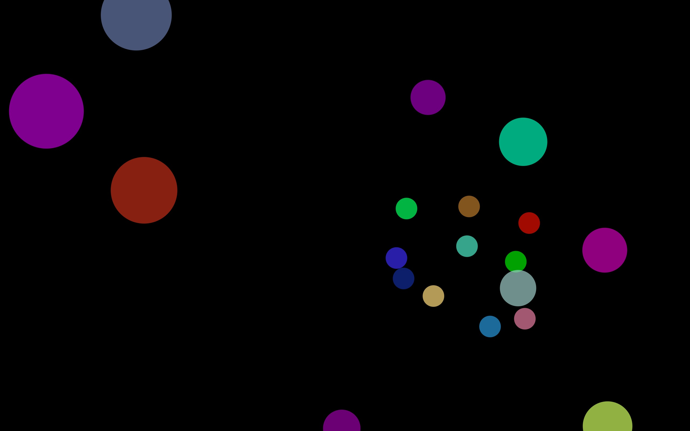

[Back](README-en.md)

# Games

There are currently 12 games (including 6 variants).
## Cream Pies

Player throws a cream pie on the target when gaze looks at it.

## Ninja

Target perfoms a random walk  and explode when player looks at it.

## Magic Cards

Several cards are displayed. When the player stares one card, it is turned. One of the card hides an image. A reward is given to the player when (s)he finds the image.

## Blocs

A big image is hidden by colored blocs. The player looks at a block to destroy it. When all blocs have disappeared, a reward is shown.

## Scratchcard

A big image is hidden under a scratchcard. With his/her gaze, the player scratches the card. When most of the image is shown, a reward is displayed.

## Colored Bubbles

Some colored bobbles come from the deep sea and explode when player look at them.

## Portrait Bubbles

Some bobbles with images come from the deep sea and explode when player look at them.

[Back](README-en.md)